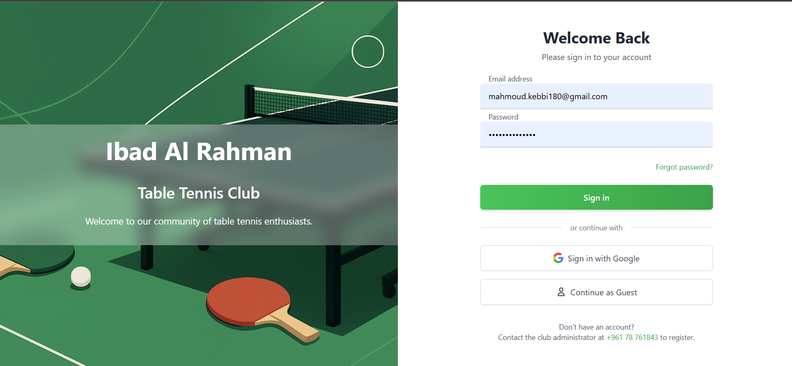
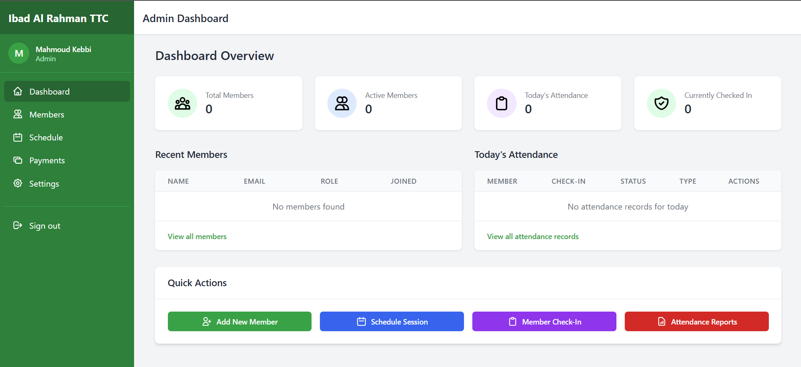
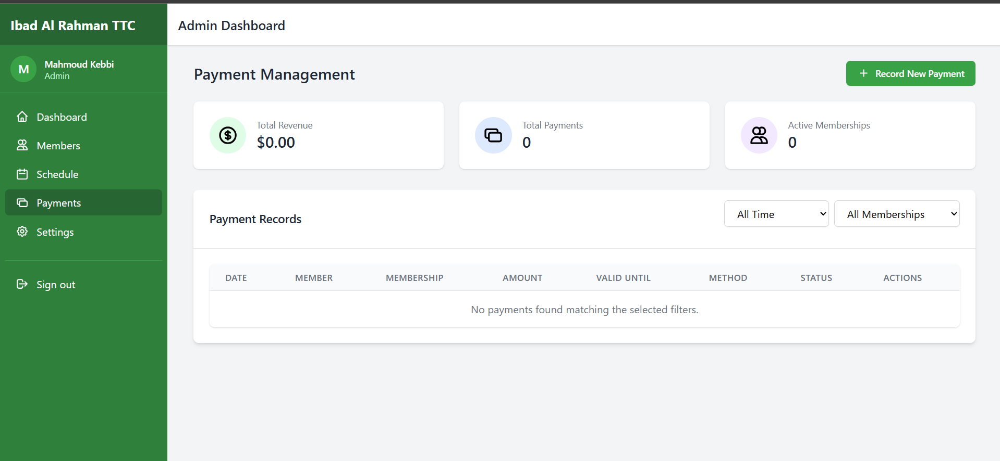
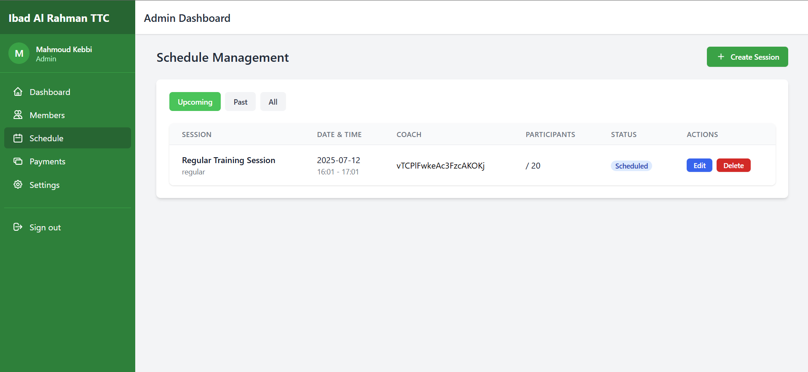

# 🏓 Ibad Al Rahman Table Tennis Club Management System

**Version:** 1.0.0  
**Date:** July 12, 2025

Welcome to the **Ibad Al Rahman Table Tennis Club Management System**, a modern web application designed to simplify and enhance the management of club activities, memberships, payments, and attendance. Whether you're an administrator, member, or guest, this system provides tailored features to meet your needs.

---

## 🚀 Features

### 🔒 Authentication & User Management

- Secure user authentication powered by Firebase
- Role-based access control: **Admin**, **Member**, **Guest**
- User profile management with photo upload
- Password reset functionality

### 👥 Member Management

- Register and manage member profiles
- Track active/inactive membership statuses
- Search and filter members with ease

### 💳 Membership & Payment System

- Multiple membership types: **1-day**, **2-day**, **3-day weekly**, **unlimited**
- Payment tracking and history
- Automatic membership expiration calculation
- Receipt generation and printing

### 📅 Scheduling

- Create and manage training sessions
- Assign coaches to sessions
- Calendar view for easy scheduling

### 📊 Dashboards

- **Admin Dashboard:** Club statistics, recent members, attendance overview
- **Member Dashboard:** Personal attendance, membership status, upcoming sessions
- **Guest Dashboard:** Club information and registration options

### 📈 Reporting

- Membership statistics
- Attendance reports
- Payment history

---

## 🛠️ Technology Stack

- **Frontend:** React.js, Redux, React Router
- **UI Framework:** Tailwind CSS
- **Backend/Database:** Firebase Firestore
- **Authentication:** Firebase Authentication
- **Storage:** Firebase Storage
- **Hosting:** Firebase Hosting

---

## 📦 Installation & Setup

### Prerequisites

- Node.js (v14.x or higher)
- npm (v7.x or higher)
- Firebase account

### Steps to Get Started

1. **Clone the repository**

   ```bash
   git clone https://github.com/yourusername/ibad-al-rahman-ttc.git
   cd ibad-al-rahman-ttc
   ```

2. **Install dependencies**

   ```bash
   npm install
   ```

3. **Set up environment variables**
   Create a `.env` file in the root directory:

   ```env
   REACT_APP_FIREBASE_API_KEY=your_api_key
   REACT_APP_FIREBASE_AUTH_DOMAIN=your_auth_domain
   REACT_APP_FIREBASE_PROJECT_ID=your_project_id
   REACT_APP_FIREBASE_STORAGE_BUCKET=your_storage_bucket
   REACT_APP_FIREBASE_MESSAGING_SENDER_ID=your_messaging_sender_id
   REACT_APP_FIREBASE_APP_ID=your_app_id
   ```

4. **Initialize Firestore**
   Set up the following collections in your Firestore database:
   - `users`: User authentication and basic information
   - `memberProfiles`: Extended member details
   - `membershipTypes`: Membership options
   - `payments`: Payment records
   - `attendance`: Attendance logs
   - `sessions`: Training session schedules

5. **Run the application**

   ```bash
   npm start
   ```

6. **Build for production**

   ```bash
   npm run build
   ```

7. **Deploy to Firebase Hosting**
   ```bash
   firebase deploy
   ```

---

## 🗂️ Project Structure

```
ibad-al-rahman-ttc/
├── public/
├── src/
│   ├── components/
│   │   ├── admin/         # Admin-specific components
│   │   ├── common/        # Shared UI components
│   │   ├── dashboard/     # Dashboard components
│   │   ├── layout/        # Layout components
│   │   ├── member/        # Member-specific components
│   │   ├── payment/       # Payment-related components
│   │   └── ui/            # Basic UI elements
│   ├── hooks/             # Custom React hooks
│   ├── models/            # Data models and utilities
│   ├── pages/
│   │   ├── admin/         # Admin pages
│   │   ├── auth/          # Authentication pages
│   │   ├── guest/         # Guest pages
│   │   └── member/        # Member pages
│   ├── services/
│   │   ├── firebase/      # Firebase service connectors
│   │   └── api/           # API utilities
│   ├── store/             # Redux store configuration
│   │   ├── actions/       # Redux actions
│   │   ├── reducers/      # Redux reducers
│   │   └── slices/        # Redux Toolkit slices
│   ├── styles/            # Global styles
│   ├── utils/             # Utility functions
│   ├── App.js             # Main App component
│   ├── index.js           # Entry point
│   └── routes.js          # Route definitions
└── package.json
```

---

## 🧑‍💻 Usage Guide

### Admin Access

Administrators have full access to manage:

- **Dashboard:** Club statistics, quick actions, recent members
- **Members:** Add, edit, activate/deactivate memberships
- **Payments:** Record payments, view history, generate receipts
- **Attendance:** Check-in/out members, view history, generate reports
- **Schedule:** Create sessions, assign coaches, manage schedules

### Member Access

Members can:

- **Dashboard:** View membership status, upcoming sessions, attendance stats
- **Profile:** Update personal info, change password, upload profile photo
- **Attendance:** View history and usage stats
- **Payments:** View payment history and download receipts

### Guest Access

Guests can:

- **Dashboard:** View club information and registration options

---

## 🌟 Future Enhancements

1. Mobile app with QR code check-in
2. Online payment processing
3. Automated notifications and reminders
4. Equipment inventory management
5. Tournament and competition management
6. Advanced analytics and reporting

---

## 📷 Screenshots

### Login Page



### Dashboard



### Payment Management



### Schedule Management



---
